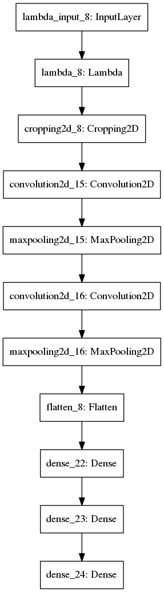
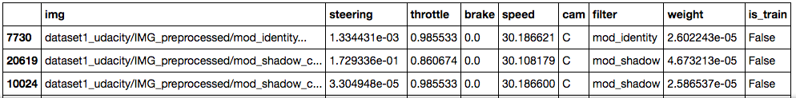
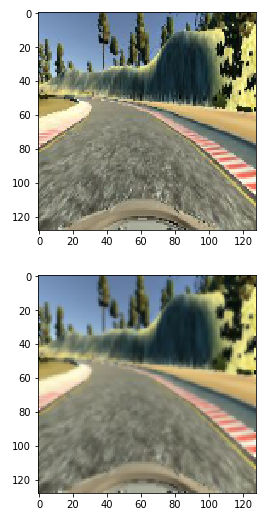
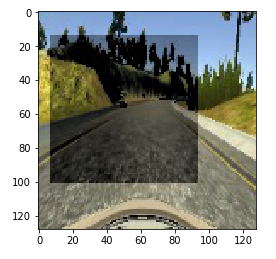
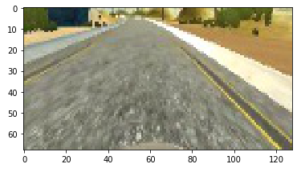
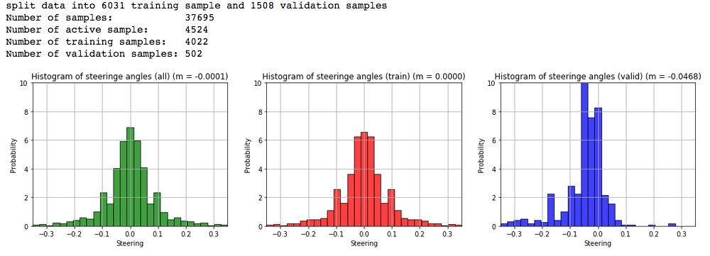
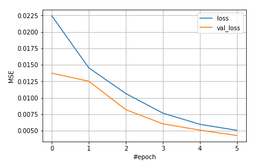

<span style='color:red'>**IMPORTANT INFO**: The current model is not able to fully finish track 1. But since the end of term 1 is approaching, I decided to submit the project anyways. Although the project is fun and I learned a lot, I almost spend 100h on it (as well as paying 150$ to Amazon). I informed my mentor numerous times that I'm stuck with the project, I also consulted the forum, slack and the walkthrough video for more tips, but sadly nothing helped in my case.</span>

# README (Behavioral Cloning Project)

# Project structure

## 1. Project files

My project includes the following files:
* self_driving_car/data_generator.py 
* self_driving_car/model.py  
* drive.py for driving the car in autonomous mode
* model.hdf5 containing a trained convolution neural network 

The `data_generator.py` contains two classes `DataPreprocessor` and `DataGenerator`. `DataPreprocessor` preprocesses the data and saves precomputed images in a separate `IMG_preprocessed` folder. Also, it creates an easy to process list of all samples (`index.pkl`). `DataGenerator` provides data during training, it also takes care of data balancing and filtering.

The model.py file contains a class `SDRegressionModel` for training and saving different convolution neural networks as well as input normalization. 

## 2. Running the model
Using the Udacity provided simulator (beta) and my drive.py file, the car can be driven autonomously by executing 

```sh
python drive.py model.hdf5
```

```
** BEST MODEL SO FAR:** models/simple3/weights/20170213_E1/weights.03-0.0027.hdf5
** BEST MODEL SO FAR:** models/simple3/weights/20170213_D2/weights.06-0.0034.hdf5
** BEST MODEL SO FAR:** models/simple3/weights/20170308_XA/weights.05-0.0069.hdf5
```

# Model Architecture and Training Strategy

## 1. Finding an appropriate model architecture

I archived the best results with `model_simple3`. This model consists of three convolutional layers with 4x4 and 8x8 filter sizes and depths 16 and three fully connected layers (see `self_driving_car/model.py`, `model_simple3`). The architecture is shown in the following image:



The model includes LeakyReLU layers to introduce nonlinearity (model.py lines 251-263).
The data is normalized in the model using `SDRegressionModel.normalize` (model.py lines 66).

## 2. Attempts to reduce overfitting in the model

The model contains dropout layers in order to reduce overfitting (model.py lines 259-262). 

The model was trained and validated on different data sets to ensure that the model was not overfitting (code line 10-16). Training data is provided using a generator through the method
`DataGenerator.get_batch_generator` (`self_driving_car/data_generator.py`),
validation data is provided by the method
`DataGenerator.get_valid_data` (`self_driving_car/data_generator.py`).

## 3. Model parameter tuning

The model used an Nesterov Adam (nadam) optimizer, so the learning rate was not tuned automatically (model.py line 25). I tried different optimizers adam and nadam both gave good results.

## 4. Appropriate training data

For training data, I used data provided by Udacity as well as a few own laps. I also drove the track backward.
I also created numerous recordings of critical corners. This results in the following datasets:

```
dataset1_udacity      dataset4_beta_sim        dataset7_curve2B  dataset8_curve3C
dataset2_twe_one_lap  dataset5_beta_backwards  dataset8_curve3A  dataset8_curve3D
dataset3_ssz_one_lap  dataset6_curve2A         dataset8_curve3B
```

All training samples are kept in a table, that looks like (index.pkl):




# Model Architecture and Training Strategy

## 1. Solution Design Approach

My overall strategy includes the following steps:

1. Generating more data
2. Augmenting the data
3. Filtering and balancing the training data
4. Train a few epochs
5. Calculate accuracy using validation data
6. Testing the model on track 1
7. Go back to step 1 further improving the best model
(all steps are documented in `CarND_Behavioral_Cloning_Training_Part5.ipynb`)

I repeated this process for different architectures:

* The CommaAI architecture
* A modified CommaAI architecture with cropping and normalization
* A simple architecture with a low neuron count
* A modified 2nd simple architecture with more convolutional filters
* A modified 3rd simple architecture with more fully connected neurons
* A modified 4th simple architecture more tunable parameters

The reason why I created different models, was that I believed that I was not able to get a further improvement because the model complexity was too low so the model is not able to capture the complexity of the given task.

I implemented different methods that allow me to filter and balance training data. As it turns out that both steps are crucial for successful training. I, therefore, implemented the following methods for the `DataGenerator` class. 

* `add_dataset(self, dataset, basepath = '/mnt/data/')`
Allows to add (preprocessed) datasets, different datasets can be combined

* `filter_data_not_moving(self, not_moving_threshold = 10.)`
Removes frames at which the car is not moving or moving very slow

* `filter_data_low_steering(self, low_steering_threshold = 0.025, low_steering_remove_prop = 0.5)`
Removes samples with low steering angle with a given propability

* `smooth_steering(self, cam = 'C', window = 4)`
Smooths the steering angle

* `shuffle(self)`
Shuffle training data

* `correct_camera_steering(self, offset = 0.0)`
Correct the camera steering angle for left/right camera images

* `activate_mod(self, mod, dset='train')`
Activates precomputed modifications (image augmentations)

* `deactivate_cam(self, cam)`
Deactivates samples that were taken with a certain camera

* `split(self, valid_size=0.1)`
Splits data into training and validation dataset

Executing these methods in the correct order is important.

For data augmentation I implemented different filters:

* `DataPreprocessor.mod_identity` --> no modification
* `DataPreprocessor.mod_lighting` --> randomly modifies the lighting
* `DataPreprocessor.mod_blur`     --> blurs images
* `DataPreprocessor.mod_flip`     --> flips images
* `DataPreprocessor.mod_shadow`   --> randomly adds shadows

I always tried to keep the dataset balance, which means that it contains equal amounts of left and right steering samples.

The final step was to run the simulator to see how well the car was driving around track one.


## 2. Final Model Architecture

The model architecture that gives the best results (model.py lines 245 - 268) looks like:

```python
model = Sequential()                                                                        
model.add(Cropping2D(cropping=((45,15),(0,0)), input_shape=(128,128,3)))                    
model.add(Convolution2D(16, 4, 4, subsample=(2, 2), border_mode="same", init='he_normal'))  
model.add(LeakyReLU())                                                                      
model.add(Convolution2D(16, 4, 4, subsample=(2, 2), border_mode="same", init='he_normal'))  
model.add(LeakyReLU())                                                                      
model.add(MaxPooling2D())                                                                   
model.add(Convolution2D(16, 8, 8, subsample=(2, 2), border_mode="same", init='he_normal'))  
model.add(LeakyReLU())                                                                      
model.add(Flatten())                                                                        
model.add(LeakyReLU())                                                                      
model.add(Dropout(.2))                                                                      
model.add(Dense(256))                                                                 
model.add(Dropout(.5))                                                                      
model.add(LeakyReLU())                                                                      
model.add(Dense(32))                                                                        
model.add(Dense(1))                                                                         
```

The model consisted of a convolution neural network with the following layers and layer sizes:

```
____________________________________________________________________________________________________
Layer (type)                     Output Shape          Param #     Connected to                     
====================================================================================================
cropping2d_15 (Cropping2D)       (None, 68, 128, 3)    0           cropping2d_input_2[0][0]         
____________________________________________________________________________________________________
convolution2d_43 (Convolution2D) (None, 34, 64, 16)    784         cropping2d_15[0][0]              
____________________________________________________________________________________________________
leakyrelu_71 (LeakyReLU)         (None, 34, 64, 16)    0           convolution2d_43[0][0]           
____________________________________________________________________________________________________
convolution2d_44 (Convolution2D) (None, 17, 32, 16)    4112        leakyrelu_71[0][0]               
____________________________________________________________________________________________________
leakyrelu_72 (LeakyReLU)         (None, 17, 32, 16)    0           convolution2d_44[0][0]           
____________________________________________________________________________________________________
maxpooling2d_15 (MaxPooling2D)   (None, 8, 16, 16)     0           leakyrelu_72[0][0]               
____________________________________________________________________________________________________
convolution2d_45 (Convolution2D) (None, 4, 8, 16)      16400       maxpooling2d_15[0][0]            
____________________________________________________________________________________________________
leakyrelu_73 (LeakyReLU)         (None, 4, 8, 16)      0           convolution2d_45[0][0]           
____________________________________________________________________________________________________
flatten_15 (Flatten)             (None, 512)           0           leakyrelu_73[0][0]               
____________________________________________________________________________________________________
leakyrelu_74 (LeakyReLU)         (None, 512)           0           flatten_15[0][0]                 
____________________________________________________________________________________________________
dropout_29 (Dropout)             (None, 512)           0           leakyrelu_74[0][0]               
____________________________________________________________________________________________________
dense_43 (Dense)                 (None, 256)           131328      dropout_29[0][0]                 
____________________________________________________________________________________________________
dropout_30 (Dropout)             (None, 256)           0           dense_43[0][0]                   
____________________________________________________________________________________________________
leakyrelu_75 (LeakyReLU)         (None, 256)           0           dropout_30[0][0]                 
____________________________________________________________________________________________________
dense_44 (Dense)                 (None, 32)            8224        leakyrelu_75[0][0]               
____________________________________________________________________________________________________
dense_45 (Dense)                 (None, 1)             33          dense_44[0][0]                   
====================================================================================================
Total params: 160,881
Trainable params: 160,881
Non-trainable params: 0
____________________________________________________________________________________________________
None
```

I tried different architecture and 160k trainable parameters should be enough since I already came up with good results with only 18k parameters.


## 3. Creation of the Training Set & Training Process

To capture good driving behavior, I first recorded different laps on track one using center lane driving.
Fist the images are resized and augmented, which looks like (here blurring and shadow):




For most model architecture the image is cropped, which gives an image of the relevant area:



After applying image augmentation and filtering samples, the training data looks well balanced.


This is the data that I used for the first 14 training epochs:



The initial model I then train with more data:


For the initial training both training error and validation error decrease:



Later no big change in the validation error is seen.

# Discussion

I have to admit, that I ran out of ideas.
I included everything that I could find online (lecture/forum/slack/github/walkthough/...), which includes for example:

* getting more training data
* getting more training data of critical curves
* increase model complexity
* decrease model complexity
* implement methods to prevent overfitting
* train for more epochs (I trained for +4h an AWS)
* augment data
* removing low steering
* cropping irrelevant data
* different steering angle correction for left/right camera
* initialization, different optimizers, different activation functions


```python

```
